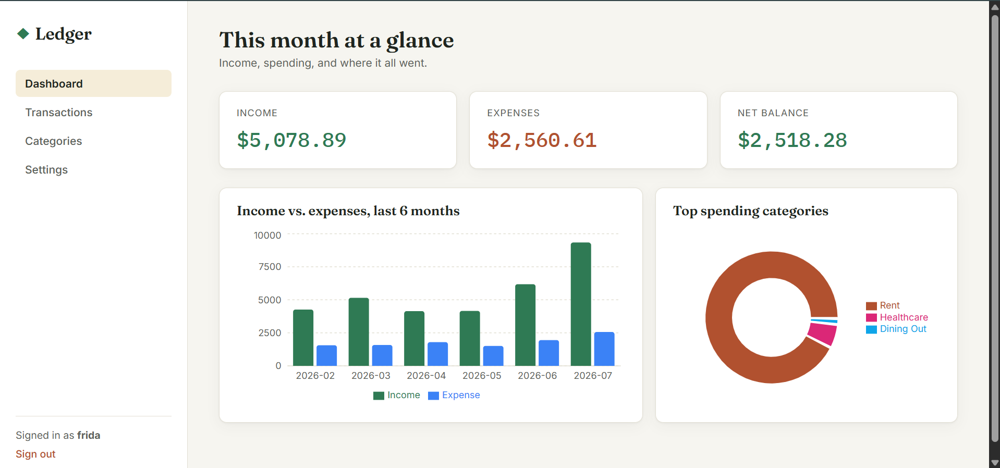
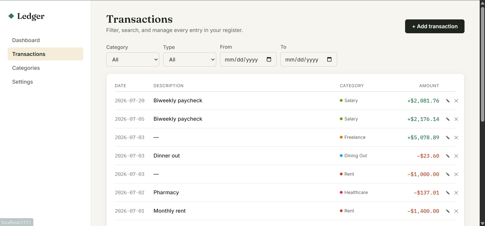
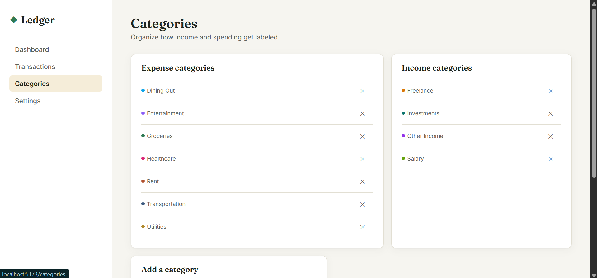

# Ledger — Personal Finance Tracker

A full-stack personal finance tracker: **Java 17 / Spring Boot** REST API, **React** (Vite) frontend,
**MySQL** for relational transaction/category/user data, **MongoDB** for user sessions and preferences,
**JWT** auth, and **Docker Compose** for one-command startup.

## Screenshots

| Dashboard | Transactions |
|---|---|
|  |  |

| Categories | Settings (dark mode) |
|---|---|
|  |

## Stack

| Layer | Technology |
|---|---|
| Backend API | Spring Boot 3.3, Spring Security, Spring Data JPA, Spring Data MongoDB |
| Relational DB | MySQL 8.4 (users, categories, transactions) — schema managed by Flyway |
| Document DB | MongoDB 7 (user sessions, user preferences) |
| Auth | JWT (jjwt), BCrypt password hashing |
| Frontend | React 18 + Vite, React Router, Recharts, Axios |
| Containerization | Docker + Docker Compose |

## Why two databases?

- **MySQL** holds data with real relational integrity and reporting needs — users, categories,
  and transactions, with foreign keys and indexes tuned for filtering/aggregation queries
  (by category, date range, and type).
- **MongoDB** holds schema-light, high-churn data that doesn't need joins — login sessions and
  per-user preferences (theme, currency, default view). Keeping this off the relational schema
  keeps the MySQL tables lean and focused on financial reporting.

## Quick start

```bash
cp .env.example .env      # adjust secrets if you like
docker compose up --build
```

Then open:
- Frontend: http://localhost:5173
- Backend API: http://localhost:8080/api

Register a new account from the UI — the backend automatically seeds a starter set of
income/expense categories for every new user.

## Running locally without Docker

**MySQL & MongoDB** — easiest via Docker even if you run the app itself locally:
```bash
docker compose up mysql mongo
```

**Backend:**
```bash
cd backend
mvn spring-boot:run
```
Runs on http://localhost:8080, connecting to MySQL/Mongo on localhost with the defaults in
`application.yml`.

**Frontend:**
```bash
cd frontend
npm install
npm run dev
```
Runs on http://localhost:5173 with API calls proxied to http://localhost:8080 (see `vite.config.js`).

## Project structure

```
finance-tracker/
├── docker-compose.yml
├── backend/                      Spring Boot API
│   ├── src/main/java/com/financetracker/
│   │   ├── controller/           REST endpoints
│   │   ├── service/               business logic
│   │   ├── repository/           Spring Data JPA (MySQL) + MongoRepository (Mongo)
│   │   ├── entity/                JPA entities (User, Category, Transaction)
│   │   ├── document/              Mongo documents (UserSession, UserPreference)
│   │   ├── dto/                   request/response payloads
│   │   ├── security/              JWT filter, util, Spring Security wiring
│   │   └── config/                CORS + security config
│   └── src/main/resources/
│       ├── application.yml
│       └── db/migration/         Flyway SQL migrations
└── frontend/                     React app
    └── src/
        ├── api/                  Axios clients per resource
        ├── context/AuthContext.jsx
        ├── pages/                Login, Register, Dashboard, Transactions, Categories, Settings
        └── components/           Sidebar, TransactionModal, PrivateRoute
```

## API overview

| Method | Endpoint | Description |
|---|---|---|
| POST | `/api/auth/register` | Create account, returns JWT |
| POST | `/api/auth/login` | Authenticate, returns JWT |
| GET | `/api/categories` | List the user's categories |
| POST | `/api/categories` | Create a category |
| PUT/DELETE | `/api/categories/{id}` | Update/delete a category |
| GET | `/api/transactions` | Filter by `categoryId`, `type`, `startDate`, `endDate`, paginated |
| POST | `/api/transactions` | Create a transaction |
| PUT/DELETE | `/api/transactions/{id}` | Update/delete a transaction |
| GET | `/api/reports/dashboard` | Totals, top spending categories, 6-month trend |
| GET/PUT | `/api/preferences` | Read/update user preferences (Mongo) |

All endpoints except `/api/auth/**` require `Authorization: Bearer <token>`.

## Notable implementation details

- **Complex SQL/JPQL queries** in `TransactionRepository` power filtering (optional category/type/date-range
  params in one query), category-grouped spending totals, and month-over-month trend aggregation used by
  the dashboard charts.
- **JWT auth** is stateless (`SessionCreationPolicy.STATELESS`); a `JwtAuthFilter` validates the bearer
  token on every request and populates the Spring Security context. Each successful login/register also
  writes a session record to MongoDB for auditing/analytics.
- **Flyway** owns the MySQL schema (`V1__init_schema.sql`) so the database structure is versioned
  alongside the code.
- Passwords are hashed with BCrypt; nothing is ever stored or logged in plaintext.

## Testing

Basic unit tests cover JWT token generation/validation and the category/auth service logic
(duplicate-name and duplicate-account rejection, default-category seeding on registration).
They use Mockito to isolate the service layer from the database, so no running MySQL/Mongo
is required to run them.

```bash
cd backend
mvn test
```

## Known limitations

This is a personal/portfolio project, not production software. Things that are intentionally
out of scope or simplified for now:

- **No refresh tokens** — JWTs are valid for 24h with no revocation beyond expiry. The Mongo
  `user_sessions` collection records sessions but isn't yet used to invalidate a token early
  (e.g. on logout or "sign out of all devices").
- **No rate limiting** on auth endpoints — a production version would throttle login attempts.
- **Category deletion doesn't cascade or warn about existing transactions** — deleting a
  category that transactions still reference will leave those transactions pointing at a
  gone category (the UI falls back to showing "Unknown"). A real version would either block
  deletion or require reassigning affected transactions first.
- **Single currency in transactions** — the currency preference only changes *display*
  formatting; all amounts are still stored as plain decimals with no currency conversion.
- **No CSV/PDF export** yet.
- **Test coverage is intentionally minimal** — a few unit tests on the service layer, no
  integration tests against real MySQL/Mongo instances (would be a good next step using
  Testcontainers) and no frontend tests yet.
- **Single-tenant assumptions** — no admin role, no team/shared-budget support.


